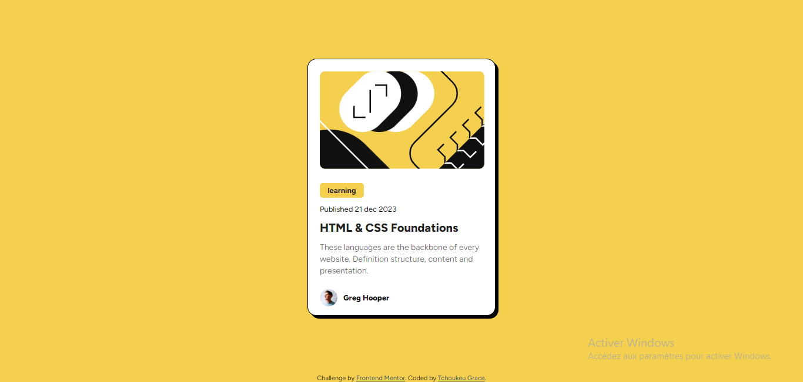
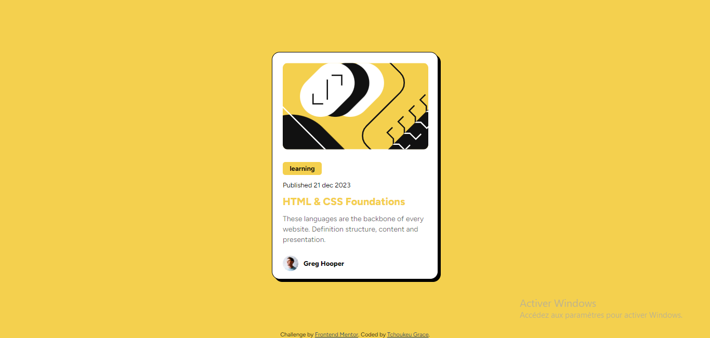
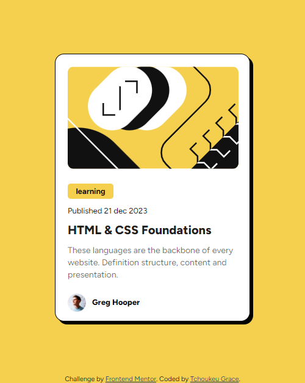

# Frontend Mentor - Blog preview card solution

This is a solution to the [Blog preview card challenge on Frontend Mentor](https://www.frontendmentor.io/challenges/blog-preview-card-ckPaj01IcS). Frontend Mentor challenges help you improve your coding skills by building realistic projects. 

## Table of contents

- [Overview](#overview)
  - [The challenge](#the-challenge)
  - [Screenshot](blog-preview.png)
  - [links](links)
- [My process](#my-process)
  - [Built with](#built-with)
  - [What I learned](#what-i-learned)
  - [Continued development](#continued-development)
  - [Author](#author)


## Overview

### The challenge

Users should be able to:

- See hover and focus states for all interactive elements on the page

### Screenshot

#### Desktop Design


#### Mobile Design



### Links

- Solution URL: [Add solution URL here](https://your-solution-url.com)
- Live Site URL: [Add live site URL here](https://your-live-site-url.com)

## My process

### Built with

- Semantic HTML5 markup
- CSS custom properties
- Flexbox

### What I learned

At first, I didn't know that the title had to be hovered over. To fix this, I added a hover attribute to the title and a pointing cursor

```html
<h1>HTML & CSS Foundations</h1>
```
```css
.card .text h1{
    font-size: 20px;
    font-weight: 800;
    transition: 0.3s ease;
    color: #000000e0;
}
.card .text h1:hover{
    cursor: pointer;
    color: hsl(47, 88%, 63%);
}
```


If you want more help with writing markdown, we'd recommend checking out [The Markdown Guide](https://www.markdownguide.org/) to learn more.


### Continued development

next time, I would like it to take fewer css lines


## Author

- Frontend Mentor - [GraceAriane](https://www.frontendmentor.io/profile/GraceAriane)
- linkedIn - [Grace Ariane Tchoukeu](https://www.linkedin.com/in/grace-ariane-tchoukeu-a290b022a)


